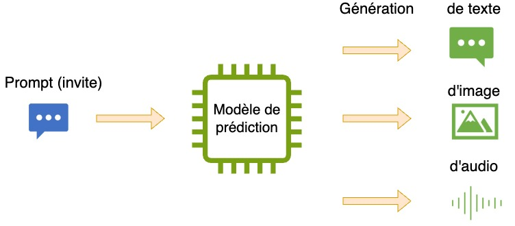
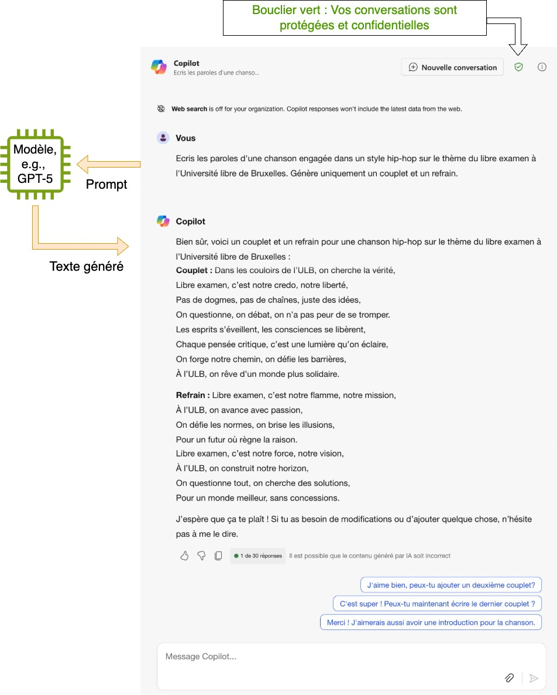
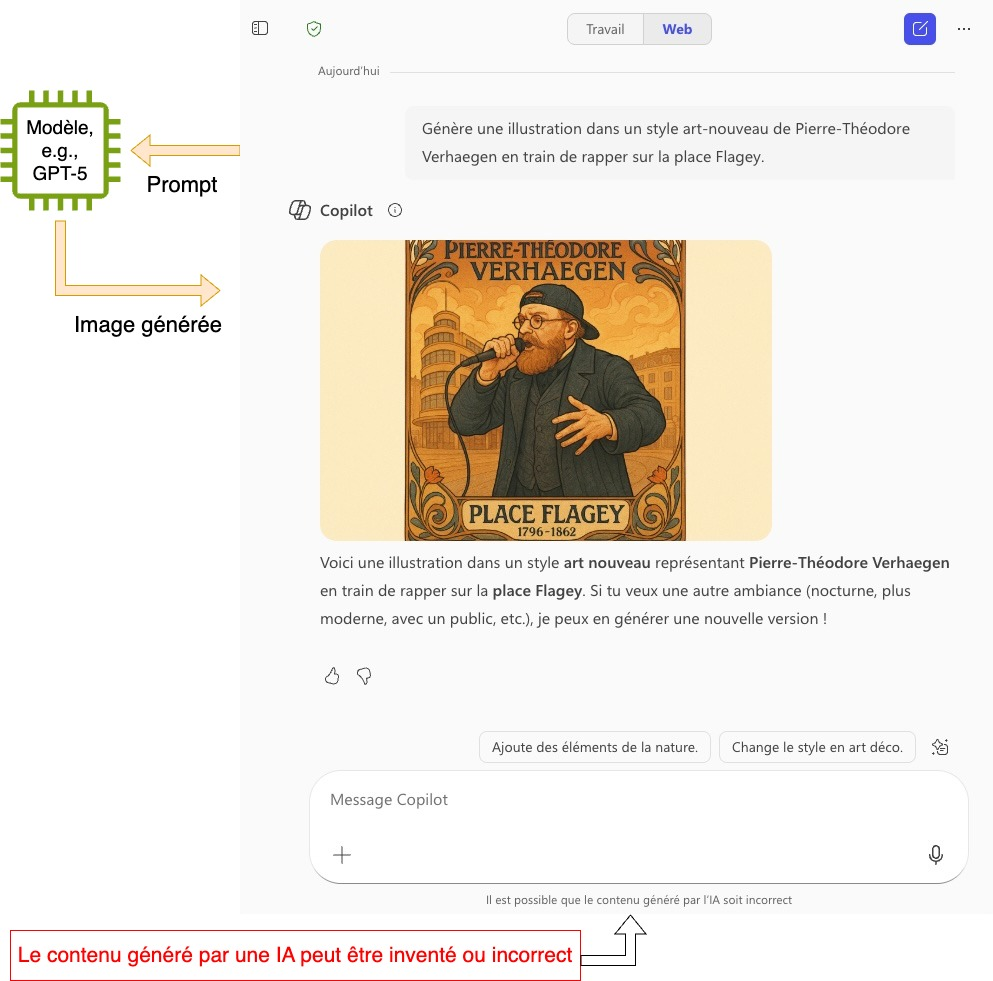

(part1)=
# IA générative: Introduction

## L'intelligence artificielle générative

Les outils d'intelligence artificielle (IA) générative sont des outils informatiques capables de générer de façon partiellement automatisée des contenus numériques tels que du texte, des images, des vidéos, de la musique ou encore du code informatique.

La capacité de ces outils à générer de nouveaux contenus provient du fait qu'ils ont été préalablement entrainés avec de large quantités de données (Wikipédia, livres numérisés, banques d'images, forum Internet, etc...), en utilisant des algorithmes d'un domaine de l'informatique appelé **apprentissage automatique (ou "machine learning" en anglais)**. Le résultat de cet entraînement est appelé un **modèle de prédiction**, qui est une représentation approximative et imparfaite des connaissances fournies lors de l'entraînement.

Ces outils fonctionnent en prenant en compte des instructions fournies par l'utilisateur, souvent désignées par le terme "**prompt**" (parfois appelé "invite" en français).
## Exemples

Voyons quelques exemples avec l'outil Microsoft Copilot, qui est l'outil d'IA générative de référence proposé par Microsoft.

**Note**: **Microsoft Copilot est l'outil à privilégier à l'ULB** car c'est le seul qui garantit la confidentialité et la propriété des données transmises ou produites grâce au contrat qui lie Microsoft à l’ULB. De nombreux autres outils d'IA génératives existent, en particulier open-source, voir la section "Boîte à outils de référence".

Microsoft Copilot est accessible à l'adresse [https://copilot.cloud.microsoft/](https://copilot.cloud.microsoft/), où vous pouvez vous y connecter avec votre adresse email ULB. Le pictogramme d’un bouclier vert doit être présent en haut à droite pour confirmer que vos conversations sont protégées.

### Génération de texte

Voici ci-dessous un échange avec Copilot, demandant de générer des paroles d'une chanson sur le thème du libre examen dans un style hip-hop.

Pas si mal !

Que s'est-il passé dans cet échange ?

- Avec Copilot en mode génération de texte, le modèle de prédiction s'appelle [GPT-5](https://fr.wikipedia.org/wiki/GPT-5). Notre prompt a été envoyé à ce modèle de prédiction, qui a renvoyé la réponse sous forme de texte. 
- GPT-5 est développé par OpenAI, la société américaine qui commercialise aussi ChatGPT. 
- **Il est important de distinguer le modèle de l'interface utilisateur**. Ici, l'interface utilisateur est celle de Microsoft, qui offre des fonctionnalités pratiques comme le fait de fournir des suggestions pour continuer les échanges, ou d'aller chercher du contenu sur Internet. Le coeur de la génération de texte est cependant le modèle GPT-5 (qui est aussi celui derrière l'outil ChatGPT d'OpenAI) qui n'a pas accès à Internet, et ne fait que prédire les mots suivants comme un outil d'auto-complétion. 

Pour plus d'explications sur ce que font réellement les modèles de langage comme GPT-5, rendez-vous sur la capsule [Comment ça marche?](https://uv.ulb.ac.be/course/view.php?id=127533&section=3) !

### Génération d'images

Le modèle GPT-5 qui se cache derrière l'interface utilisateur Copilot permet aussi de générer des images. Si l'on fait une demande d'image ou d'illustration le modèle retourne une image, que Copilot affichera dans l'interface.

Ici, nous demandons de générer une illustration, dans un style art-nouveau, de Pierre-Théodore Verhaegen en train de rapper sur la place Flagey.

Rendez-vous sur la page Wikipédia du [fondateur de l'ULB](https://fr.wikipedia.org/wiki/Pierre-Th%C3%A9odore_Verhaegen "https://fr.wikipedia.org/wiki/Pierre-Th%C3%A9odore_Verhaegen") et demandez-vous: 
- Ressemble-t-il à la représentation qui en est faite par l'IA générative ? 
- La période pendant laquelle il a vécu correspond-elle à celle de l'art-nouveau ? 
- A quelles dates correspondent celles indiquées en bas de l'image ? 

Cet exemple illustre un point essentiel des IA génératives : si elles peuvent se révéler assez efficaces d'un point de vue créatif, elles ne sont cependant pas conçues pour générer des contenus factuellement corrects. 
### Génération d'audio/vidéo

Enfin, générons une musique à partir des paroles de chanson obtenues précédemment.

<video controls="true" title="C'est le libre examen">
        <source src="https://github.com/ULB-AcademIA/guide_usages_IA/raw/refs/heads/main/1_IA_g%C3%A9n%C3%A9rative_introduction/attachments/libre_examen_suno.mp4">libre_examen_suno.mp4
</video>

C'est ici l'outil [Suno](https://suno.com/create) que nous avons utilisé, en demandant un morceau dans un style "hip-hop avec des riffs de piano". L'application Suno a aussi au passage généré une illustration pour la chanson, représentant un intérieur d'ancienne bibliothèque.
## A retenir

Nous avons ainsi, en quelques minutes, créé le texte d'une chanson, produit des illustrations et mis le tout en musique. 

Retenons ici que si les outils d'IA générative utilisés se sont montrés assez utiles d'un point de vue créatif, ils l'ont beaucoup moins été d'un point de vue factuel.
## Vocabulaire de base pour l'IA générative

**Prompt (aussi appelé requête, ou invite de commande)** : Description textuelle de la tâche qu’une IA générative doit effectuer ([Wikipedia](https://fr.wikipedia.org/wiki/Ing%C3%A9nierie_de_prompt "Wikipedia")).

**Modèle de prédiction :** Fonction produite après avoir été entraînée à reconnaître des relation statistiques dans des données. Dans le cas de la génération de texte, on parle de **grand modèle de langage** (ou **large language model (LLM)** en anglais) ([Wikipedia](https://fr.wikipedia.org/wiki/Grand_mod%C3%A8le_de_langage "Wikipedia")). 

**Apprentissage automatique (ou "machine learning" en anglais)** : Champ d'étude de l'[intelligence artificielle](https://fr.wikipedia.org/wiki/Intelligence_artificielle "intelligence artificielle") qui se fonde sur des approches mathématiques et statistiques pour donner aux ordinateurs la capacité d'« apprendre » à partir de données ([Wikipedia](https://fr.wikipedia.org/wiki/Apprentissage_automatique "Wikipedia")).

**Multimodalité** : En apprentissage automatique, la **multimodalité** est la capacité d'un système à traiter ou à générer plusieurs types d'information (texte, images, son, actions...) ([Wikipedia](https://fr.wikipedia.org/wiki/Multimodalit%C3%A9_(IA))).

**Algorithme :** Suite finie et non ambiguë d'instructions et d’opérations permettant de résoudre une classe de problèmes ([Wikipedia](https://fr.wikipedia.org/wiki/Algorithme "Wikipedia")).

