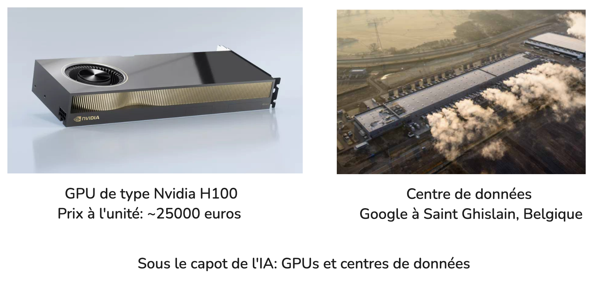
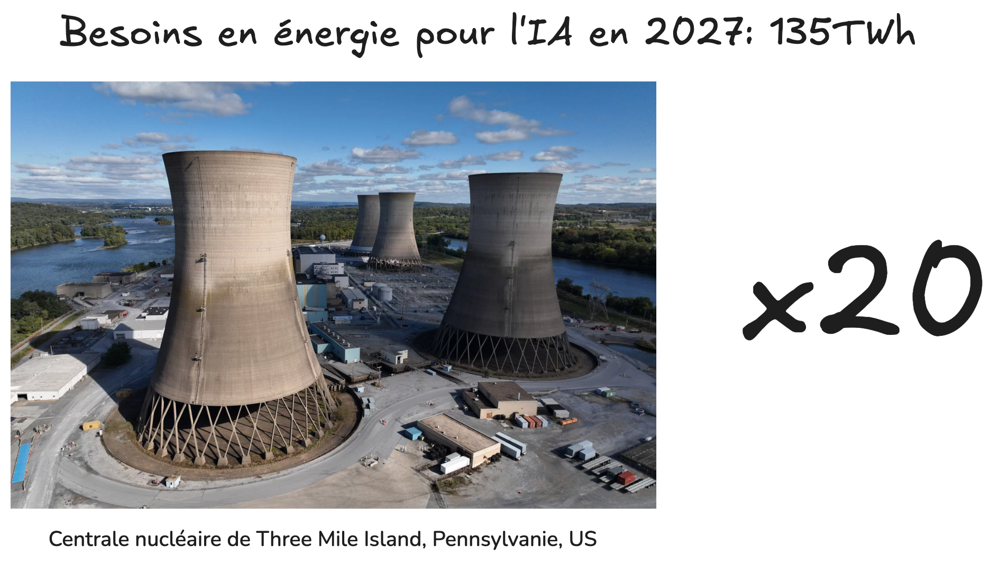

(part5)=
# Points de vigilance

## Les outils d'IA générative ne sont pas des moteurs de recherche

Ils ne sont pas conçus pour fournir des résultats fiables et cohérents. Comme présenté dans la section "Fonctionnement de l'IA générative", ce sont des outils d'auto-complétion conçus pour produire des contenus statistiquement probables. 

Ces outils peuvent donc inventer des contenus, se contredire, ou produire des contenus incohérents ou bizarres.

Par exemple, ils peuvent :

- retourner des réponses différentes pour un même prompt. Les réponses à une question peuvent même se contredire. La cause est l'aspect probabiliste dans la génération de la réponse.
- sembler avoir des opinions, des préférences ou des goûts (comme par exemple préférer la couleur bleue). Ceux-ci ne sont que le reflet des biais présents dans les données d'entraînement. 
- donner de meilleures réponses lorsque l'on demande de réfléchir étape par étape (ou [de respirer un grand coup](https://arstechnica.com/information-technology/2023/09/telling-ai-model-to-take-a-deep-breath-causes-math-scores-to-soar-in-study/ "de respirer un grand coup")). Ceci est une conséquence de l'auto-complétion, par laquelle l'IA générative va tenter de prédire une procédure de résolution qu'elle pourra ensuite prendre en compte pour prédire une réponse.

Plutôt que des outils de recherche d'information, ce sont surtout de bons alliés pour des activités d'exploration d'idées (tout en prenant garde à leurs biais) ou de reformulation.

## Fiabilité des informations produites par l'IA

L'IA peut commettre des erreurs et des hallucinations lorsqu'elle produit du contenu. Pour bien comprendre cela, nous vous invitons à lire la section sur le fonctionnement de l'IA :  "[Fonctionnement de l'IA générative](https://uv.ulb.ac.be/course/view.php?id=127533&section=2)".

Voici des exemples d'incohérences et d'erreurs provenant d'outils d'IA :

    
<iframe title="Présentation des formes basiques" frameborder="0" width="1200" height="675" style="position: absolute; top: 0; left: 0; width: 100%; height: 100%;" src="https://view.genially.com/675aa6b651a0827adad068f3" type="text/html" allowscriptaccess="always" allowfullscreen="true" scrolling="yes" allownetworking="all"></iframe> 

Cela montre bien que même si les intelligences artificielles peuvent nous aider dans notre pratique professionnelle, il faut toujours vérifier si les informations qu'elles nous transmettent ne sont pas erronées ou biaisées.

Il faut garder à l'esprit que lorsqu'on utilise une IA, nous restons responsables du travail qui est généré si nous décidons de l'utiliser sans le retravailler et sans vérifier la véracité des informations. 

Ces biais et ces erreurs peuvent avoir de graves conséquences. C'est pourquoi le contrôle humain reste essentiel lors de leurs utilisations.

## Propriété intellectuelle, plagiat, et protection des données

Tout comme les réseaux sociaux ou internet en général, les contenus partagés dans une requête faite à un outil d'IA générative ne sont généralement pas confidentiels par défaut. En absence de la connaissance approfondie des conditions d’utilisation, **une information transmise à un outil d'IA générative doit être considérée comme publique**. 

En outre, deux points de vigilance spécifiques aux IA génératives doivent être considérés:

1. Souvent, on ne sait pas quelles sont les données d'entrainement d'un modèle, qui peut reproduire des verbatim de contenus protégés. Il est essentiel de toujours remonter aux source primaires, et de **ne pas copier-coller** les réponses fournies par un outil d'IA générative sous peine de pouvoir être accusé de non respect de droit d'auteur ou de plagiat.
2. Inversement, il faut faire attention à toutes les informations que l'on communique dans un chatbot. Les données peuvent servir à l'entrainement. Si celle-ci se retrouvent incluses dans l'entrainement d'un modèle, elle seront quasiment impossible à retirer par la suite. 

Le **droit à l'oubli est rendu encore plus difficile à appliquer avec les outils d'IA génératives**. Alors que dans les cas d'Internet ou d'un réseau social, il est possible de faire la demande à un site, un moteur de recherche ou un réseau social de retirer un contenu spécifique, il est techniquement quasiment impossible d'enlever une information spécifique d'un modèle d'IA générative sans en refaire l'entraînement.
## Les outils d'IA générative ne sont ni neutres ni objectifs

Leurs productions sont le reflet de leurs données d'entraînement. On retrouve ainsi souvent de nombreux biais liés au genre ou aux origines, qui sont le reflet de biais présents dans les données. En effet, les outils d'IA les plus utilisés actuellement sont conçus par des travailleurs occidentaux, majoritairement masculins et des biais culturels et des biais de genre ressortent suite à cela. 

Il n'est pas toujours possible, ni d'ailleurs nécessairement souhaitable, de retirer les biais d'un outil d'IA générative. Les valeurs morales diffèrent en fonction des individus et des cultures. De même qu'il existe des journaux, des partis, ou des communautés exprimant différents opinions, il est tout aussi souhaitable qu'il existe une diversité d'outils d'IA génératives représentatives de différents systèmes de valeurs. 

En ce sens, le développement d'outils et de modèles d'IA générative open-source est essentiel.

    
<iframe title="Présentation des formes basiques" frameborder="0" width="1200" height="675" style="position: absolute; top: 0; left: 0; width: 100%; height: 100%;" src="https://view.genially.com/674b7de2593768b5f5a5074c" type="text/html" allowscriptaccess="always" allowfullscreen="true" scrolling="yes" allownetworking="all"></iframe> 

## Impact environnemental

Les outils d'IA générative sont particulièrement gourmands en ressources informatiques. C'est d'ailleurs pour cela que les meilleurs modèles ne sont disponibles qu'en ligne: Ils demandent trop de mémoire et de puissance de calcul pour pouvoir fonctionner sur un laptop ou un smartphone. 

Sous le capot de l'IA se trouvent des processeurs spécialisés, le plus souvent des cartes appelées **GPU** (pour Graphical Processing Unit, en anglais). Il s'agit de processeurs de calcul particulièrement chers et grands consommateurs en énergie. 

Ci-dessous est illustré une carte GPU typique (Nvidia H100, dont le prix avoisine les 25000 euros) de celles utilisées pour l'entraînement et l'utilisation des modèles de prédiction d'IA. Elles sont conçues par le fabricant Nvidia, qui est le leader mondial du marché et qui est devenu en quelques années l'une des entreprises les plus riches du monde du fait de l'explosion de l'usage de ces cartes dans les applications d'intelligence artificielle. 

Les nouveaux centres de données de type [hyperscale](https://fr.wikipedia.org/wiki/Hyperscale) tels que celui de Google à Saint Ghislain en Wallonie accueillent entre autre les infrastructures nécessaires pour satisfaire la demande exponentielle des applications liées à l'IA.

🏭  L’évolution rapide de l’IA rend difficile l’obtention de chiffres précis sur l'impact environnemental de l'IA générative. Les rapports environnementaux des GAFAM de 2023 révèlent cependant clairement l’ampleur de son impact sur l’environnement comme le souligne le site [Alt Impact de l'Ademe](https://altimpact.fr/bonnes-pratiques/eviter-le-recours-a-lia-generative/): Microsoft a ainsi vu ses émissions de carbone augmenter de 30 % depuis 2020, tandis que Google a enregistré une hausse de 48 % depuis 2019. 

💧 Plus proche de chez nous, concernant la consommation d'eau, le [rapport environnemental de Google 2024](https://sustainability.google/reports/google-2024-environmental-report/) précise que le centre de données de Saint Ghislain en Belgique près de Mons consomme annuellement environ un million de mètres cubes d'eau pour empêcher la surchauffe de ses serveurs, dont la majeure partie s'évapore. Ceci équivaut à la consommation annuelle d'environ 10 000 ménages de la région.

⚡ Et pour l'énergie, le fonctionnement d'un outil comme ChatGPT requièrent plusieurs cartes GPUs de type H100, dont la consommation d'énergie équivaut à chauffer une maison. A la place d'une maison, ce sont ici de puissants GPUs dans un centre de données qui chauffent, et nécessitent ensuite l'eau dont nous venons de parler pour être refroidis. La consommation de ce type de cartes GPUs en 2027 [pourrait atteindre 135TWh](https://altimpact.fr/bonnes-pratiques/eviter-le-recours-a-lia-generative/), soit la production d'environ 20 centrales nucléaires de type [Three Mile Island](https://en.wikipedia.org/wiki/Three_Mile_Island_Nuclear_Generating_Station), telle que celle que Microsoft envisage de réouvrir en 2028 pour ses besoins en IA. 

Et individuellement, comment pouvons-nous estimer le coût environnemental d'une conversation avec notre chatbot favori?

Le site [Compar:IA](https://www.comparia.beta.gouv.fr/) donne quelques éléments d'information : cela dépend du type de modèle utilisé, de la longueur de la question et de la réponse, et des sources d'énergie utilisées. [Teste-le et compare](https://www.comparia.beta.gouv.fr/) les réponses de différents chatbots et leurs impacts environnementaux.

Un exemple ici de l'impact énergétique d'une petite conversation avec le modèle Google Gemini 2.0 Flash (un modèle de taille moyenne):

Le site nous donne aussi une idée de l'impact environnemental équivalent en terme de visionnage de vidéo en ligne (approximatif), qui est aussi une activité très consommatrice en énergie.

Au-delà de l'impact environnemental de l'IA, c'est plus largement nos usages et notre dépendance au numérique (dont l'IA n'est qu'une composante) qu'il est aussi intéressant de questionner: Avons-nous réellement besoin de ce nouveau téléphone ou gadget ? Besoin de ChatGPT pour écrire un message ? Besoin de parler à son frigo plutôt qu'ouvrir la porte pour voir ce qu'il y a dedans ? 

De nombreuses organisations comme l’ADEME considère ainsi qu’il faut raisonner en termes de [**sobriété numérique**](https://www.ademe.fr/presse/communique-national/numerique-environnement-entre-opportunites-et-necessaire-sobriete/), en questionnant, priorisant et in fine réduisant certains usages numériques. 

Eviter d'avoir recours à l'IA générative fait ainsi partie des pratiques à impact très fort mises en avant par le programme [Alt Impact](https://altimpact.fr/), qui propose les alternatives suivantes à l’IA générative:

1. **Préférer les moteurs de recherches à l’IA générative** lorsqu’ils peuvent offrir le même service. Préférer aussi les moteurs comme DuckDuckGo plutôt que Google ou Bing qui intègre maintenant l'IA générative dans leur réponse (et sont moins respectueux de vos données personnelles). Et pour des questions factuelles comme « Quelle est la capitale du Cambodge ? », utiliser tout simplement Wikipédia! Et si c’est vraiment inévitable d'interroger un IA, aller droit au but : exit les conversations superflues ! 
2. **Privilégier une IA spécifique (traduction, orthographe)** plutôt qu’une IA générative, cela consommera beaucoup moins d’énergie. Exemple pour de la traduction, privilégier DeepL ou un site de dictionnaire comme “WordRéférence” pour chercher un mot en particulier plutôt que des IA conversationnelles.
3. **Eviter autant que possible le recours à l’IA générative pour générer des images ou des vidéos**. Oui c’est amusant… mais son coût environnemental est salé. Les études montrent que générer une image ou encore une vidéo avec l’IA consomme bien plus d’énergie que de créer du texte, et qu’en plus, il y a souvent plus de déchets dans le processus… Dans la mesure du possible, utiliser des images déjà existantes provenant de banques d’images libres de droit.

