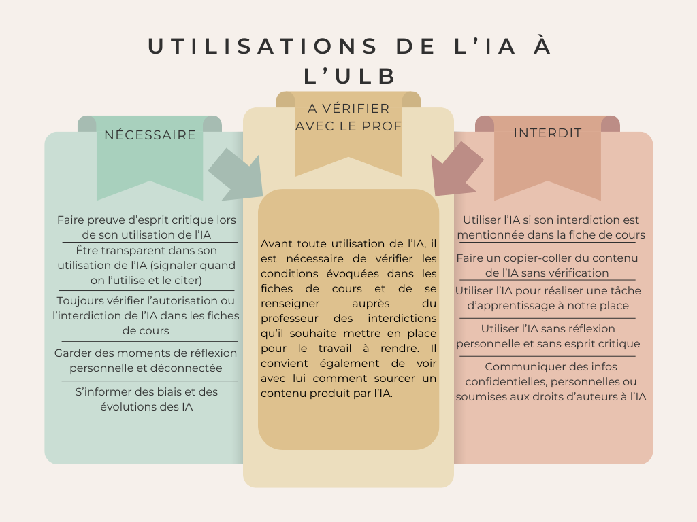
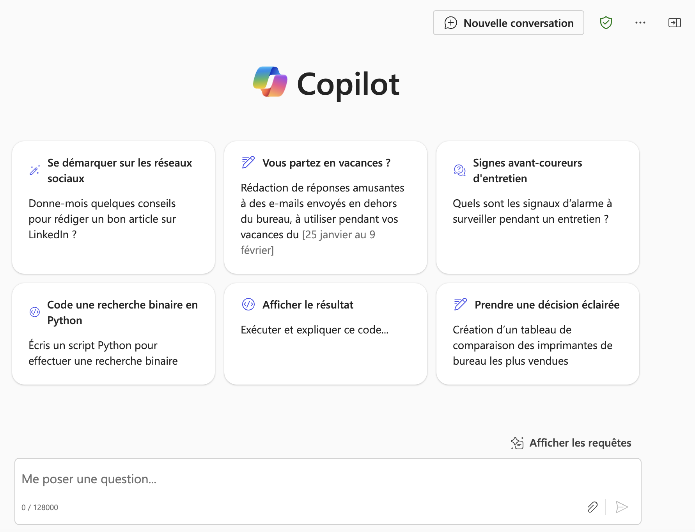

(part6)=
# Principes d'utilisation à l'ULB

L'utilisation des outils d'intelligence artificielle générative (IAG) est permise à l'ULB pour vous assister dans votre parcours académique, mais elle est encadrée pour garantir l'intégrité de vos travaux.

Les dispositions relatives aux principes d'utilisation de l'IA générative dans les enseignements à l'ULB ont été mises à jour en juillet 2025 et sont définies dans [le règlement général des études (RGE)](https://www.ulb.be/fr/documents-officiels/reglement-general-des-etudes), en particulier à travers l'article 40. Les règles et principes à suivre peuvent être résumés ainsi :

**Règles spécifiques aux évaluations** :

- Pour les **mémoires et travaux de fin d'études**, l'utilisation de l'IA est autorisée sauf restrictions ou limitations motivées et fixées par les facultés ou les enseignants. 
- Pour les **autres évaluations (examens, devoirs)**, l'utilisation de l'IA est **interdite** sauf si l'enseignant l'autorise de manière explicite. 

Dans tous les cas, l'usage autorisé des outils d’IAG est soumis aux **principes de subsidiarité, de responsabilité et de transparence** : 

- **Travail personnel avant tout** : L'IA doit être un outil de support, et non remplacer votre réflexion, votre recherche et votre analyse de sources. C'est le **principe de subsidiarité**.
- **Transparence** : Mentionnez toujours l'utilisation de l'IA dans vos travaux (mémoires, devoirs, etc.). Expliquez clairement ce qui a été généré par l'IA et pourquoi vous l'avez utilisée. C'est le **principe de transparence**. Les examinateurs peuvent vous interroger sur vos usages.
- **Responsabilité** : Assurez-vous de ne pas violer les droits d'auteur, qu'il s'agisse de vos propres productions ou de contenus générés par l'IA. Vous êtes responsable du contenu que vous intégrez. C'est le **principe de responsabilité**.

Le non respect de ces règles et principes peut amener au risque de fraude.  

**Conséquences des fraudes – Article 83 du RGE (« Plagiat et sanctions »)**

- Une sanction académique dépendant de la gravité de la fraude. Cela peut aller jusqu’à l’attribution d’une note de 0/20 à l’épreuve évaluée.
- Des sanctions disciplinaires sont également applicables en plus de la sanction académique du RGE (ex : réprimande, obligation de valider une formation complémentaire, suspension temporaire, interdiction d’accès à la période d’examens en cours, exclusion …)

**En cas de doute, la meilleure approche est de vous référer à votre enseignant ou au règlement des études pour les consignes spécifiques à chaque cours.**

## Liens vers les règlements

Les dispositions relatives aux principes d'utilisation de l'IA générative dans les enseignements à l'ULB sont définis dans:

- [Dispositions liminaires, article 40 et 83 du RGE, et dispositions facultaires complémentaires](https://www.ulb.be/fr/documents-officiels/reglement-general-des-etudes)
- [Règlement de la Commission de discipline relative aux étudiants](https://portail.ulb.be/fr/documents-officiels/instances-participatives/autres-instances-participatives/reglement-de-la-commission-de-discipline-relative-aux-etudiants?ksession=13a71232-da6b-4171-a6ea-5e1054877863)  
- [Extraits du RGE :  Disposition liminaire h et article 40](https://universitelibrebruxelles.sharepoint.com/:b:/s/GRP_TaskforceFormationMassivelIA/EbwvevSVQQlMlAQ54LEI3nEBelsJO2EzAshJB56QgR5CiQ?e=UKh3MK)

## Outil recommandé

L'outil institutionnel recommandé est [Copilot](https://copilot.cloud.microsoft/). Son usage garantit la confidentialité et la propriété de vos données (transmises ou produites). **C’est le seul outil qui offre actuellement ce niveau de sécurité juridique à l’Université**.

Cet outil dispose des modèles de type GPT-5 à l’instar de ChatGPT. Il est possible notamment d’uploader un ou plusieurs fichiers dans la conversation (en cliquant sur l'icône de trombone dans la fenêtre de prompt), que le chatbot peut alors analyser, synthétiser, traduire, etc. 

Accès : Rendez-vous sur [https://copilot.cloud.microsoft/](https://copilot.cloud.microsoft/), et connectez-vous avec votre adresse email ULB. Une fois connecté, **le logo d’un bouclier vert en haut à droite doit être présent**. Il confirme que vos conversations sont protégées.

## Points de vigilance

**Attention au plagiat involontaire !** Les LLMs peuvent générer des verbatim de contenus existants et reprendre des contenus protégés par des droits d’auteur. Ne copiez-collez jamais tel quel la production d'un LLM, et cherchez et référencez toujours les sources originales.

Bien qu'il soit impossible de retracer l'origine des textes produits par les outils d'intelligence artificielle à large modèle de langage (LLM), leur usage pour produire un contenu, dans la mesure où il n'est pas une production originale de votre part, doit toujours être signalé. [VI - E - 1 - What's up Doc](https://uv.ulb.ac.be/mod/book/view.php?id=492082&chapterid=22010). Le recours non référencé à une production d'intelligence artificielle générative est considéré comme une fraude académique ou scientifique. A ce titre, dans le cadre de l'enseignement, elle est soumise à sanction fixée par le [Règlement général des études, articles 40 et 83](https://www.ulb.be/fr/documents-officiels/reglement-general-des-etudes)).  [VI -H -1 What's Up Doc](https://uv.ulb.ac.be/mod/book/view.php?id=492785&chapterid=22037).
 
**Erreurs, biais et incohérences**. Les LLM peuvent très facilement contenir des erreurs factuelles, des biais idéologiques ou des incohérences. Consultez la [page dédiée sur ce sujet](https://uv.ulb.ac.be/course/view.php?id=127533&section=5).

## Citer l'IA en note bibliographique : dans quels cas ?

Rappel : l'IA ne peut pas être utilisée comme une source primaire d'information.

La citation ne s'applique pas pour des usages d'élaboration ou de correction du texte académique (ex : correction de fautes d'orthographes, résumé, brainstorming) => utiliser ici les manières de mentionner l'IA : déclaration, annexe, ou dans la partie méthodologique du travail.

Pour le reste, si l'auteur souhaite référencer une production d'une IAG reprise telle quelle dans un travail académique ( ex: sourcer une image générée par une IA,  sourcer une traduction générée par une IA), on peut suivre le schéma suivant, inspiré du style APA :

(Voir aussi  [VI - F - 3 - What's up Doc](https://uv.ulb.ac.be/mod/book/view.php?id=492137&chapterid=22027))
	Nom du producteur de l'Intelligence Artificielle (Année de consultation), Nom de l'Intelligence Artificielle (Date de consultation/version) [prompt/question utilisé.e]. Disponible sur Internet à l’adresse : https://…

Exemple : 
	Microsoft. (2025). Copilot Chat (4 juillet 2025). [Traduction]. Disponible sur Internet à l’adresse : https://www.exemple.be
